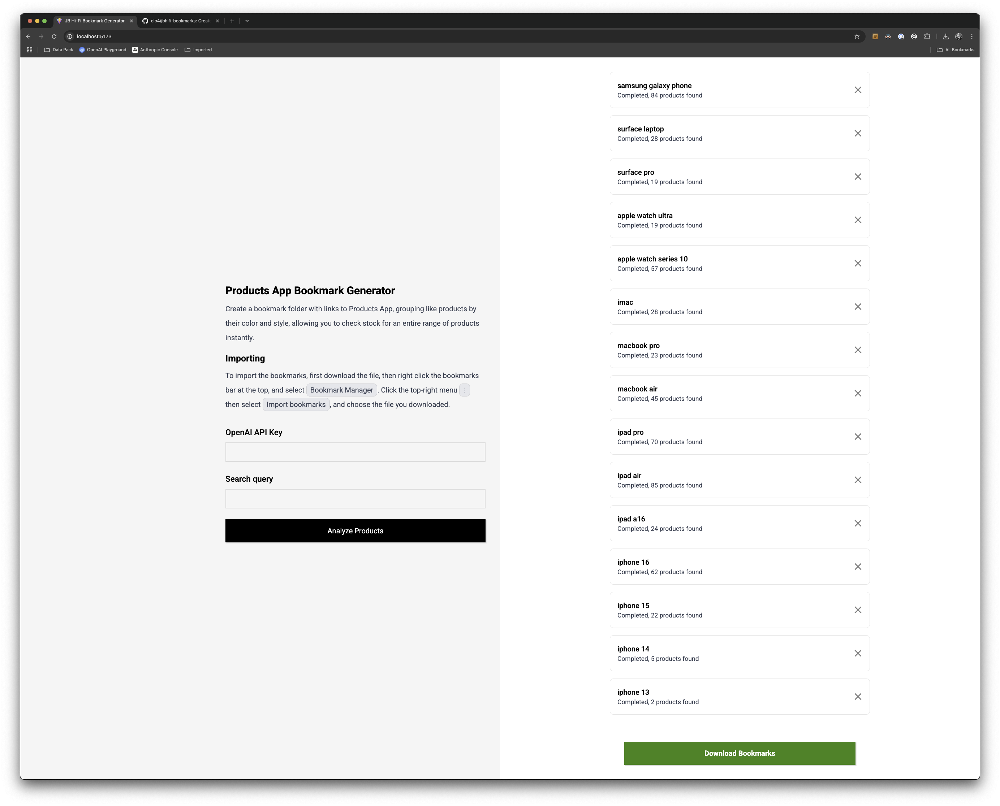

# Bookmark Tree Generator

Without introducing any new systems, solves a real-world problem that
salespeople at JB Hi-Fi have: how can I check stock for multiple products
without wasting time?

It's not uncommon to get a customer that doesn't care at all about the color of
their product, or will base their purchasing decision on what colors are
available in close proximity. JB has an internal tool, Products App, that allows
people to check this information (stock level, availability at locations, other
details) but only for one product at a time. There isn't any link from one
product to related products, and even if there was, that would still be a
unit-by-unit check.

This web tool allows people to generate a bookmark file that can be imported
into a browser. Products that you search for will be "analyzed" by an LLM
(currently GPT 4.1 mini) and put into groups by their spec. This allows
salespeople to open all the tabs in that folder at once, letting them see stock
for as many products as there are in the lineup.

